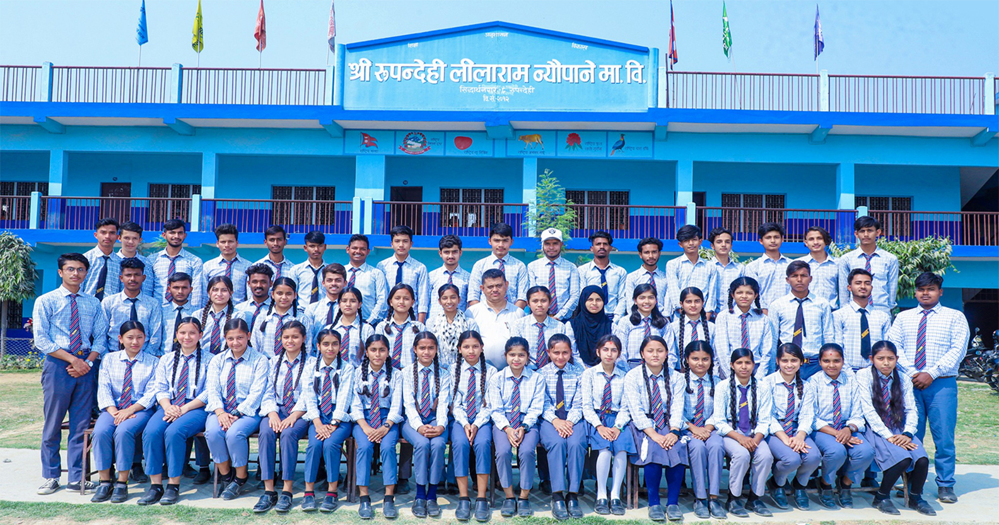
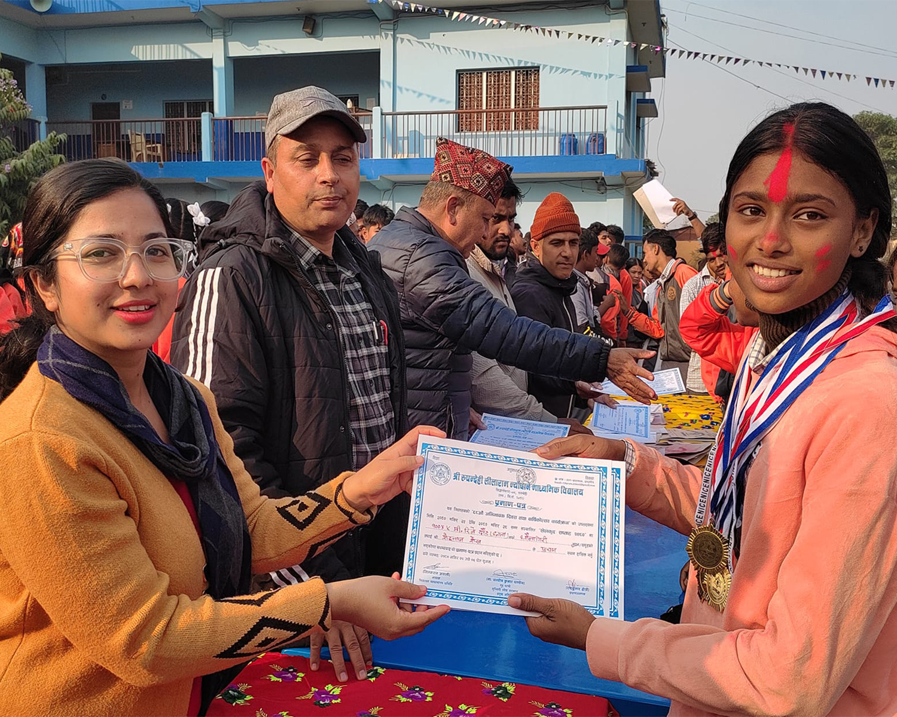
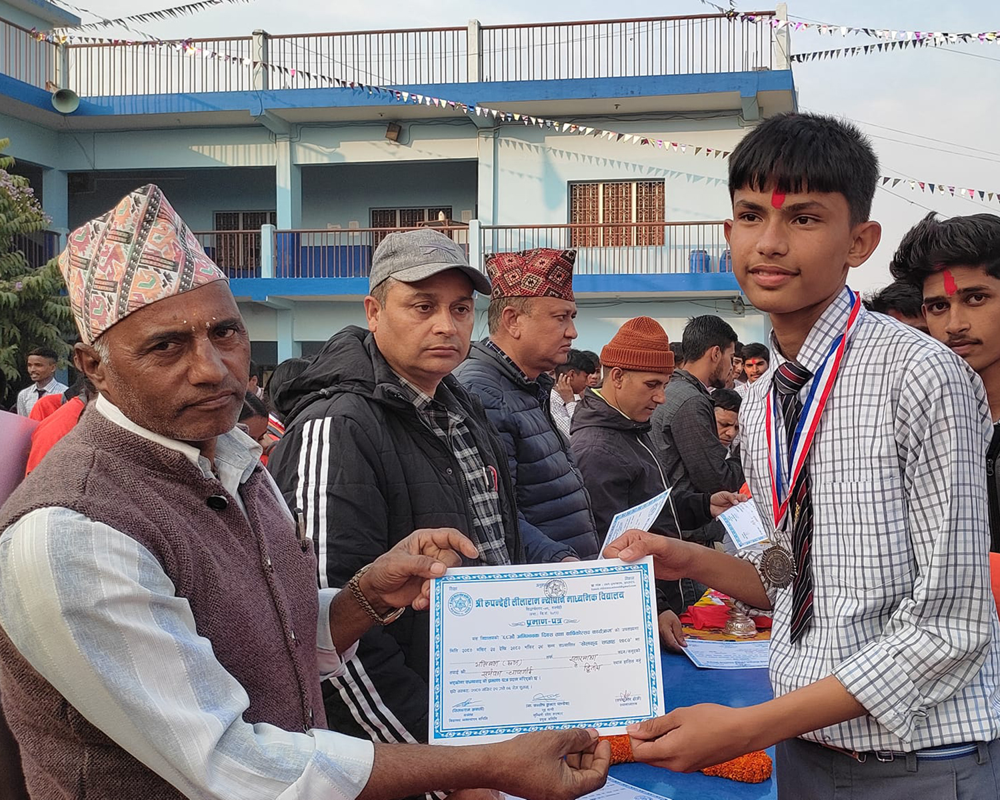

<!DOCTYPE html>
<html lang="en">
<head>
    <meta charset="UTF-8">
    <meta name="viewport" content="width=device-width, initial-scale=1.0">
    <title>Document</title>
</head>
<body>

 <a href="Index.html"> 

    

<a style="text-align:center; padding-left: auto;"> <a style="font-size:17px; background-color: rgb(17, 0, 248); padding: 10px 20px 10px 20px; 
color: white;"href="Index.html " target="_main"> Home </a>

<a style="text-align:center; padding-left: auto;"> <a style="font-size:17px; background-color: rgb(17, 0, 248); padding: 10px 20px 10px 20px; 
color: white;"href=" about.html " target="_main"> Why RLNSS ? </a>

<a style="text-align:center;"> <a style="font-size:17px; background-color: rgb(17, 0, 248); padding: 10px 20px 10px 20px; 
color: white;"href=" https://www.facebook.com/rupandehililaram.hss " target="_main"> FaceBook </a>

<a style="text-align:center;"> <a style="font-size:17px; background-color: rgb(17, 0, 248); padding: 10px 20px 10px 20px; 
color: white;"href=" https://www.google.com/maps/place/Rupandehi+Lilaram+Neupane+Ma.Vi./@27.5134625,83.4515613,17z/data=!3m1!4b1!4m6!3m5!1s0x39969a478dfd2e49:0x776650859fef8e37!8m2!3d27.5134625!4d83.4515613!16s%2Fg%2F11bw3c8k8c?entry=ttu&g_ep=EgoyMDI0MDkwMy4wIKXMDSoASAFQAw%3D%3D " target="_main"> Location </a>

<H1 Style=" color: black; margin-top: 40px; font-size:50 px; text-align:center;"> Rupandehi Lilaram Neupane Secondary School </H1>

<tr>
<td></td>
</tr>

 <b>Shree Rupandehi Lilaram Neupane Ma Vi.</B> or RLNSS previously known as <B> Shree 5 Indra Rajya Laxmi Ma Vi. </B> situated at heart of Bhairahawa city established 2012 BS is now recognized and awarded as the best government school of Siddharthanagar
municipality recently. Carrying more than 2200 students every academic sessions, RLNSS has remarked several milestones creating excellent professionals in various sectors of national and international platforms such as <U>Doctors, Engineers, Pilots, CA, Bankers, Established Businessman, Industrialist, Government employees and many more professionals </U> since 67 years of glory. 

 <a style="font-size:17px; background-color: rgb(17, 0, 248); padding: 10px 20px 10px 20px; 
color: white;"href=" https://www.facebook.com/rupandehililaram.hss "> FaceBook </a> 

<H1 Style="font-size:50 px; text-align:center;"><U> Some Captured Moment</U> </H1>

<tr>
<td></td>
<td></td>
<td></td>
</tr>
<tr>
<td></td>
<td></td>
<td></td>
</tr>

<H1 Style=" margin-top: 40px; font-size:50 px; text-align:center;"> Purposal Video </H1>

<video Style="margin-top: 37px; width: 70%; "src="video/video1.mp4" controls />

</body>
</html>

